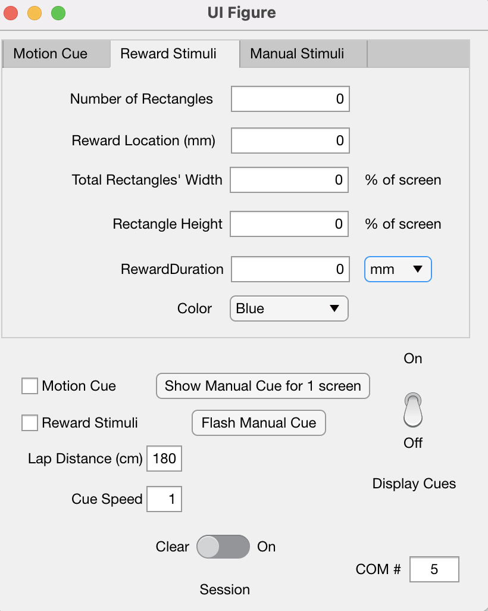

# Peripheral Stimuli

* [Video Demonstration](#video-demonstration)
* [Setup](#setup)
* [Using the GUI](#using-the-gui)
* [Development Notes](#development-notes)

The goal of this project was to display customizable visual stimuli based on the position and velocity of the animal.

Currently, the system allows the user to generate various rectangles that move in proportion to the animal's position, as well as display a separate rectangle or set of rectangles.


## Video Demonstration:
https://www.youtube.com/watch?v=NoDWEkQQQuM


## Setup

To set up this system, first make sure that the Teensy Distance firmware includes a line that says

```
Serial.println(distance);
```
right before the analogWrite command, and that no other Serial print statements exist.


Then, ensure that Psychtoolbox (http://psychtoolbox.org/) is installed and on the path. A simple way to test this is to type out one of the existing demos in the command window. I like to use ```MovingSquareDemo``` which displays a red square oscillating on the screen. (Note: running this demo before every trial also ensures that Psychtoolbox can access the screen, which was finnicky on my laptop. To fix the screen issue, I would either rerun the MovingSquareDemo or restart my computer. I was unable to access the screen while Screen Recording, so further work is needed with an experimental setup to ensure reliable acces to the display screen.)

With the Teensy accurately printing distances to Matlab and PsychToolBox accessing the screen, the GUI is ready for use.

## Using the GUI

The UI Figure that shows up looks has two panels, including tabs for different stimuli.



The tabs allow the user to specify properties of the rectangles. Namely, the number of rectangles (N), their total width (W) as a percentage of the screen, and the height (H) as a percent of the screen. At any given moment there will be N number of rectangles, which in total take up W percent of the screen width, and take up H% of the screen height. Currently, the rectangles will always be vertically centered and move laterally as the animal moves. These rectangles are evenly spaced apart, but each N group of rectangles may have a bigger horizontal gap. The user may also select the color of these rectangles, and the options are White, Gray, Green, Blue, or Red, but any RGB array can work in the actual code portion that calls the rectangles.

#### Motion Cue Tab
The rectangle(s) always on display and move with the animal.

#### Reward Stimuli Tab
The rectangle(s) display only when the animal reaches the specified Reward Location. Because this uses serial printing and not voltages, mm precision is possible. The stimuli will display for the duration specified which can be in distance or time. (Note: the stimuli is currently set to wrap around the screen if the duration is long enough. Future work can include a screen width duration feature or to turn off wrap around and simply stop displaying the rectangles when their position leaves the screen.)

#### Manual Stimuli Tab

Currently a placeholder for future possible features. Does not do anything at the moment. The idea behind this is to allow the user to manually flash a stimuli at the click of a button which are on the lower panel of the GUI. However, this feature requires an external screen to access the GUI at the same time as the stimuli is being displayed. Additionally, testing will be needed to see what priority the button clicks get in the code.

#### Lower panel

The checkboxes determine which stimuli are shown, so check the motion cue to show the rectangles with the parameters entered in the motion cue tab, and check the reward stimuli to show the rectangles entered in the reward stimuli tab. The lap distance is default to 180, and is used to scale the current position. The Cue Speed edit field determines the speed of the rectangles relative to the animals velocity, so 2 would move twice as fast as 1.

Finally, the Session switch and COM# edit field are identical in purpose to the Current Generator GUI, and tell MATLAB which COM# to begin a session with for communication. Session must be turned on to begin displaying stimuli.

Finally, once all the parameters are entered as desired, flip the display cues switch to On and the stimuli will begin to display.

#### Changing the stimuli

Currently, the stimuli will end on the click of any keyboard button. Then, you can enter in new stimuli and flip the switch to off and back to on again to display the new stimuli. Future work with an external display may involve changing the while loop to be tied to the Display Cue Switch rather than a keyboard click.


<hr/>

## Development Notes

The following were other software platforms initially considered. Matlab and Psychtoolbox were chosen due to accessibility, learning curve, and sufficient graphics power, but others may provide more precise timing or more rich stimuli. Of the following BonVision was strongly considered because it was demonstrated to have much more precise timing due to direct access to the computer graphics card, but does require Windows.

* BonVision https://bonvision.github.io/info/Home/ 
* LED Matrices
  * MAX7219 driver with RS232 library
* Quake2:
  * Used in https://www.ncbi.nlm.nih.gov/pmc/articles/PMC2771429/
* Epic Games Unreal Engine
* OGRE 3D (https://www.ogre3d.org/)


Initial challenges involved figuring out to read the distance from the Teensy. The trick was to combine a ``` Serial.println(distance)```  in the Teensy firmware with ``` currentPosition = fscanf(app.SerialID,'%g',4); ```
in Matlab. Specifying the size of the string ensured that the readings were reliable and accurate.

With a changing position and existing demos for moving a square on a screen, generating a single moving rectangle was straightforward. However, increasing the number of rectangles did pose some challenges, as the Psychtoolbox command ```Screen('FillRect', window, color, rect)``` takes different dimensions for 1 rectangle vs multiple rectangles. Conditional transposes were required to ensure that the size of the rectangle position matrix matched what the FillRect method requires. Additionally, Matlab surprisingly did not have clear documentation on the units of ```tic```, so I had to manually figure out that it stores .01 microseconds.
                                                        


