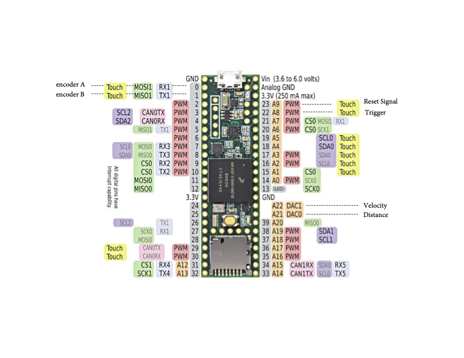
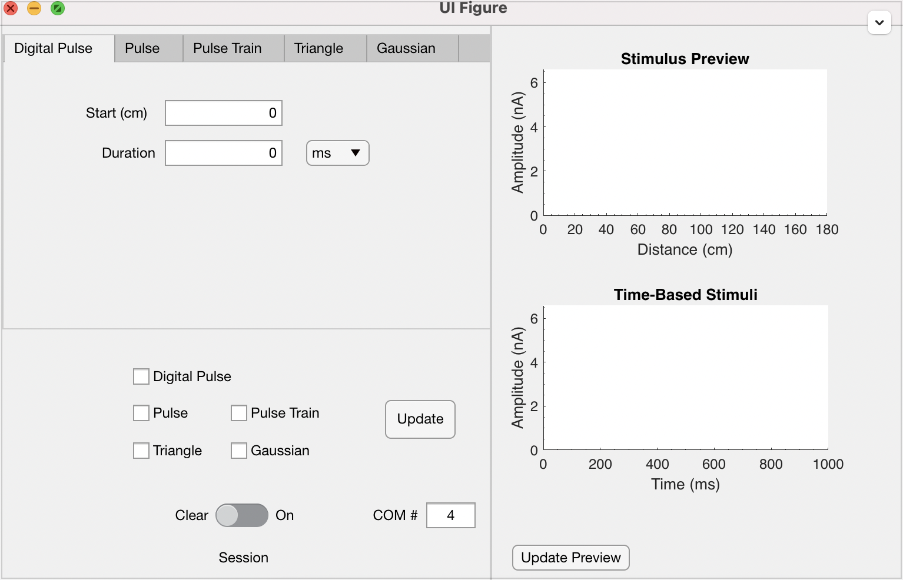
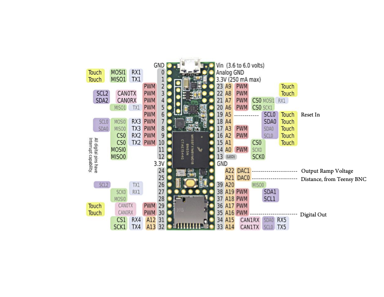

# Sections:

* [Overview](#overview)
* [Current Generator](#current-generator)
* [Teensy Firmware](#teensy-firmware)
* [Wavesurfer](#wavesurfer)
* [Bpod Protocol](#bpod-protocol)
* [Rig Programs and Data Analysis](#rig-programs-and-data-analysis)

# Overview

The following document details the software and firmware developed for the Magee Lab in Houston. Questions can be directed to Roy Phillips (aroyphillips@gmail.com).

The experimental system makes use of a linear treadmill whose position and velocity are encoded used a Teensy microcontroller. Then for data acquisition, we use a combination of open-source software implemented in the MATLAB environment. [Wavesurfer](https://wavesurfer.janelia.org/) from Janelia allows for online processing, plotting, and recording of neurophysiological signals, such as velocity, distance, licks, and cellular voltages. For delivering rewards and generating system triggers, we use the Bpod system from [Sanworks] (https://sanworks.io/shop/products.php?productFamily=bpod), which uses a RotaryEncoderModule to measure position, and also records event timestamps for offline validation of the Wavesurfer recording. Current injections can be done using a customized GUI in Matlab, which sends stimuli parameters to an embedded system made for Teensy.

# Teensy Firmware

Directory firmware used in the Teensy devices. For setup of the Teensy device, refer to https://www.pjrc.com/teensy/index.html. These firmware are written with the Teensyduino add-on in the Arduino environment.

### RotaryEncoderModule.ino:
From Sanworks: https://github.com/sanworks/Bpod_RotaryEncoder_Firmware
Firmware for the BpodRotaryEncoderModule. 

### TeensyEncoder20200904.ino:

This is the most up to date and commented firmware for calculating the distance and velocity data from the Avago HEDM-55xx Rotary Encoder with 512 tics. Pinout can be found in DistanceModulePins.pdf



### TeensyEncoder201904.ino:

Equivalent to TeensyEncoder20200904.ino but not commented fully. Made for 512 tics encoder.

### TeensyEncoder101519.ino:

Equivalent to TeensyEncoder201904.ino, except made for 1024 tic encoder. As a result the DIST_PER_COUNT constant is half as large as that in TeensyEncoder20200904.ino

### LaserControl.ino

Controls the output of a laser used to activate a neuronal silencer, archaerhodopsin.
A sine wave has been demonstrated to be more effective for that control, so this firmware generates the sinusoidal output and a trigger to control the shutter. To control for rebound excitation, the sinusoid is gradually reduced when the animal's velocity remains at 0 for a specified length of time.


# Wavesurfer

+examples Directory contains Wavesurfer User Code.

These user codes allow for online analysis of the NI MAX DAQ signals, including stimulation, recording, and plotting. They were made during the early stages of the development two target paradigm, and as a result include many features not used for general paradigms.

Installation instructions and documentation for wavesurfer can be found at https://wavesurfer.janelia.org/ 

Remember to save all figures before closing waversurfer!!!

Description of custom user codes are below:

### TreadMillProtocol.m:

This is the main protocol used in current experiments to record and plot real time neurophysiological data. This generates a plot of licks, velocities, and reward releases for each lap, but also plots information no longer used in general experimentation, such as the target reward location. Remember to save all figures before closing waversurfer!!! 

Description of notable methods are below.

##### Notable Methods:

##### delete():
closes the raster plot and the velocity plot.

##### startingRun():
Initializes parameters and arrays stored on each lap.


##### completingRun(), stoppingRun(), abortingRun():
Include an autosave command so that the figure is saved after closing wavesurfer without manually saving. If you do not go and move this file elsewhere, the figure will be overwritten on another session.


##### dataAvailable():
Main function used for online analysis of data.

obtains analog and digital data using the methods:
```Matlab
analogData = wsModel.getLatestAIData();
digitalData = wsModel.getLatestDIData();
```

The digital data provides information about the reset signal and other inputs to the PFI channel on the DAQ.
In this specific protocol, the Reset signal appears as a 1 in the digital scans, while the RewardRelease appears as a 2.

The analog data contains all the analog signals displayed on waversufer, including the licks, position, velocity and cellular voltages.

If a new lap starts, based on the reset signal information, the lick and velocity plot updates to show the lick target and licks.

##### syncRasterFigAndAxes_():

Creates the figures, axes, and labels.

##### velo2rgb():
Converts input velocity to red green and blue by first scaling the velocity up to be in the range of 380 to 800 and then converts that value to RGB array.

### TreadMillProtocol_training.m

This protocol was developed before TreadMillProtocol.m and autosaves every lap instead of just at the end, causing it to get slower and slower between laps as the figure gets more complicated. Does not plot the two blue line targets used during the blocked protocol, instead counts correct licks as licks with 10cm of the reward release.

# Bpod Protocol

This directory contains BpodProtocol used to govern the behavioral cues and reward delivery. The Bpod device is useful for the delivery of precisely timed amounts of liquid reward, and maintains an online environment to keep track of position. However, its plotting features are limited as is the accuracy of its velocity measurement, so these protocol are paired with recordings using wavesurfer protocol.

The core logic of BpodProtocol is the State machine. These states include conditions that end the state and directions for which state to transition next. All possible input and output events are listed in the settings icon in the Bpod GUI. 

For further reference on creating Bpod Protocol, review the Bpod wiki https://sites.google.com/site/bpoddocumentation/

 #### Binary State Notation 

A note on one event state notation that appears in the sample protocol not mentioned on the wiki site is the use of binary to specify the output signal:

Any of the outputs may be multiplexed to have 2^N different signals, where N is the number of ports. For example, a watervalve may have 3 ports, as does the WireOut signal. To encode individual output, add 2^i for all i ports that you want to turn on, indexing from 0 up to N-1. 

To output only on WireOut1, the event would be: {‘WireState, 2^0} or equivalently, {‘WireState, 1}. To output on both WireOut1 and WireOut3, the event would be {‘Wirestate’, 2^0+2^2}, equivalently {‘WireState’, 5}. The function bin2dec may be helpful as one can provide a string representing the WireState and it will output the equivalent decimal form. So, output on both WireOut1 and WireOut2 would be {‘WireState’,  bin2dec(’011’)}.

<hr/>
An overview of the files is below:

The recommended protocol illustrate how to set up the state machine, set the RotaryEncoder parameters and change the thresholds on a trial by trial basis. Additionally, for the protocol where the exact distance is important, ProbabilisticReward establishes a WaitForReset state to begin the state machine, ensuring that each trial is synched exactly with the belt.

Recommended protocol to review:

### ProbabilisticReward2.m
** Recommended protocol to review and modify for new users. 
This protocol specifies reward at one of two locations, user can change the reward each lap. Parameters: WaterValveAmt (µL), RewardLocation1 (cm), RewardLocation2 (cm), Location2Probability (0 to 1), SearchForLap (0 or 1), SearchDistance (cm). Setting SearchForLap to 1 allows the user to change the SearchDistance location at which the Bpod waits ends the trial and searches for the reset signal to start a new lap; only need to change this if lap lengths are not 180cm.

### RandomAcclimation,m:
Designed for a blank belt acclimation where reward is randomly given every 100-260cm that the animal runs, so that the expected reward location is every 180cm. User has control of the range about and expected value. Parameters: WaterValveAmt (µL), RewardCenter (cm), RewardRange (cm). RewardCenter and RewardRange specify  the center and range of the uniform distribution from which the reward location is chosen, updated each lap. This protocol is useful to train animals that already run to lick.

### RewardDistanceTraining.m:
Fully controllable release of water for training. Supplies reward at given distance and immediately starts a new lap with the user input RewardDistance as the new target distance. The lap lengths change depending on the user input distance, so it is useful to train the mice to run. User Parameters: WaterValveAmt (µL), RewardDistance (cm)


Older protocols (may not need be needed anymore).

### FlexibleRewardFish.m: 
allows the user to change the location on a trial by trial basis. To use this protocol to vary the reward location each lap, simply change the location of RewardLocation1. Additional features include the ability to randomly place the reward at one of two locations. To include a second reward location, change the Location2Probability value to a non-zero number between 0 and 1, and set the RewardLocation2. The parameter WaterValveAmt allows the user to control the microliter amount of water provided. Includes legacy code that uses the wavePlayer module to play one of three sounds and flash lights, but these features are no longer used for this protocol.

### TwoTriggerProtocol.m: 
Generates two output digital pulses which can be used to cue stimuli in wavesurfer or other stimuli control software if not using the current generator module. Parameters: WaterValveAmt (µL), RewardDistance (cm), StimulusTrigger1 (cm), StimulusTrigger2 (cm). Lap length cannot exceed 179.

### TwoTriggerProtocol_TwoBeambreaks.m: 
Same as TwoTriggerProtocol but made for a belt with two beambreaks to physically mark the end and the beginning of a lap. This protocol was designed to combat the gradual change in Bpod distance calculations over the course of hundreds of laps. Parameters: WaterValveAmt (µL), RewardDistance (cm), StimulusTrigger1 (cm), StimulusTrigger2 (cm). 


# Rig Programs and Data Analysis

Directory contains scripts used to analyze Bpod and Wavesurfer data.

### TwoCam.m:
A useful rig program to show both cameras connected to the system. To run, simply ensure that TwoCam is on the path and then type TwoCam into the command window.

### recreatePlot.m:

Given a file path of the wavesurfer h5 file, recreates the plot of licks, velocity and reward release that is generated online. Note: due to differences in calculations and online jitter, these plots are not exactly the same.

### analyzeShortLaps.m:

Was used to understand discrepancies between the Bpod distance and the Teensy generated distance in Bpod. This script may be useful in learning how to extract data from the Bpod session variables and Wavesurfer h5 files.

Given a Bpod file name, plots several laps to analyze the position and velocity recorded within the Bpod machine. Additionally, given a wavesurfer h5 file, measures the velocity for each lap and compares it to the Bpod velocity.

# Current Generator

This is associated code for a Matlab based user interface to send parameters to a Teensy microcontroller to work as a function generator. The experimentalist can update these parameters on-the-fly, for trial-by-trial modifications to the stimulus. Requires a headstage amplifier set to voltage clamp mode, using the gate input for the digital pulse for depolarizing pulses, or mid stimulus pulse.

The .mlapp files generate the GUI used by the experimenter. To use this, simply type the file name into the command window. A GUI will show up that looks like this:



This GUI consists of the three panels: the stimulus parameter tabs, the stimulus preview plots, and the checkbox and update panel.

Before Updating any stimuli parameters, enter in the COM port where the Teensy current generator device is located. Then move the Session slider from Clear to On and make sure no warnings appeared that the COM # was incorrect or that the COM is unavailable, possibly due to use in another window. 

The stimulus parameter tab panel allows the user to input a starting location for the stimulus to begin, and a duration for that stimulus in either milliseconds or cm. The Digital Pulse can be used to enter the command input of the head stage amplifier, which can then be scaled to be positive or negative. All other stimuli are analog and enter the other input of the headstone amplifier. The Analog Pulse is similar to the digital pulse but can only take on amplitudes from 0 to 6.6 nA. The Pulse Train parameters include Period and Pulse width parameters, which can be either in Hz or cm. The Triangle pulse allows the user to generate a ramp-like potential with a start, peak, and end position, and cannot be combined with other analog stimuli. The Gaussian pulse generates a gaussian curve that can be asymmetrically balanced with different widths at half-max, and  cannot be combined with other analog stimuli. 

The checkboxes allow the user to specify which stimuli are on at a given time. The Stimulus Preview plot shows what will be generated if the current parameters are sent, and the Time-Based Stimuli figure provides a more precise view of any stimuli parameters based on time rather than position. 

Once the stimuli parameters are at the desired values, the user can press the Update button to send these parameters to the Teensy device. Any improper values will be rejected with a warning message and the parameters will not send until the user fixes the values and presses Update again. These parameters will then update after the next reset signal.

The .ino firmware allows the Teensy to read incoming stream of characters from the GUI and generate the stimuli based on those values. To set up the current generator device please refer to the pin-out sheet in CurrentRampModulePins.pdf



Versions currently available:

** Recommended to use Version 1.1 or Version 3. 

### Version 1:

This version provides the 5 basic stimuli types (Digital Pulse, Pulse, Pulse Train, Triangle, Gaussian), but only supports pulse trains up to 70 Hz period.

The associated files are Controllable_Fgen_v10.mlapp & fgen_teensy_03192020.ino.

### Version 1.1:

This version provides the 5 basic stimuli types (Digital Pulse, Pulse, Pulse Train, Triangle, Gaussian), and supports pulse trains up to 300 Hz period.

The associated files are Controllable_Fgen_v10_FasterConsistentSerial.mlapp and fgen_teensy_04272020_faster_ConsistentSerial.ino.

### Version 2: 

This version provides the 5 basic stimuli types (Digital Pulse, Pulse, Pulse Train, Triangle, Gaussian), with an additional independent pulse train that can be run at the same time as the pulse or the other pulse train. Only pulse trains up to 70 Hz period are supported.

The associated files are Controllable_Fgen_v12_TwoTrains.mlapp and fgen_teensy_04012020_TwoTrains.ino.

### Version 3:

This version provides the 5 basic stimuli types (Digital Pulse, Pulse, Pulse Train, Triangle, Gaussian), with an additional independent pulse train that can be run at the same time as the pulse or the other pulse train. Pulse trains up to 300 Hz period are supported.

The associated files are Controllable_Fgen_v13_TwoTrainsFaster.mlapp and fgen_teensy_04062020_TwoTrainsFasterMicros.ino.

